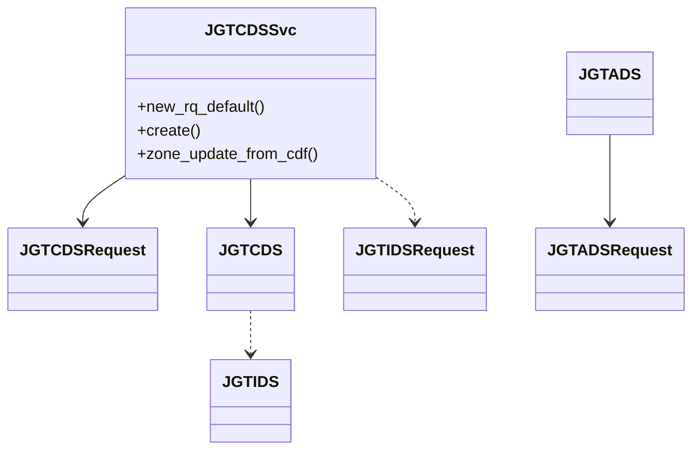

# Class Relationships

This document provides high level diagrams for the main services and command line interfaces.

These diagrams show how service classes depend on their request objects and core data modules.
